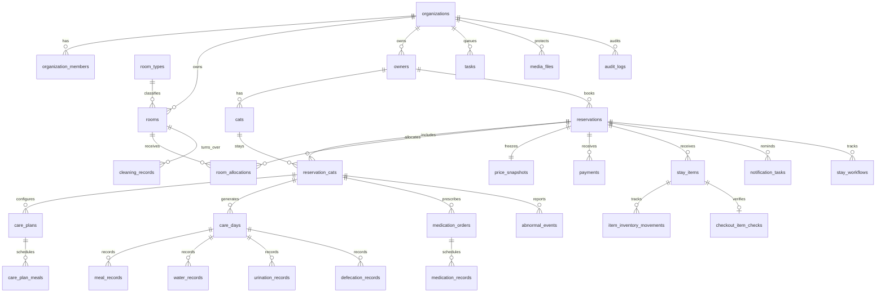

# ER 圖（實際實作摘要）

```mermaid
erDiagram
  organizations ||--o{ organization_members : has
  organizations ||--o{ rooms : owns
  room_types ||--o{ rooms : classifies
  organizations ||--o{ owners : owns
  owners ||--o{ cats : has
  owners ||--o{ reservations : books
  reservations ||--o{ reservation_cats : includes
  cats ||--o{ reservation_cats : stays
  reservations ||--o{ room_allocations : allocates
  rooms ||--o{ room_allocations : receives
  reservations ||--|| price_snapshots : freezes
  reservations ||--o{ payments : receives
  reservation_cats ||--o{ care_plans : configures
  care_plans ||--o{ care_plan_meals : schedules
  reservation_cats ||--o{ care_days : generates
  care_days ||--o{ meal_records : records
  care_days ||--o{ water_records : records
  care_days ||--o{ urination_records : records
  care_days ||--o{ defecation_records : records
  reservation_cats ||--o{ medication_orders : prescribes
  medication_orders ||--o{ medication_records : schedules
  reservations ||--o{ stay_items : receives
  stay_items ||--o{ item_inventory_movements : tracks
  stay_items ||--o| checkout_item_checks : verifies
  reservation_cats ||--o{ abnormal_events : reports
  reservations ||--o{ notification_tasks : reminds
  reservations ||--o{ stay_workflows : tracks
  rooms ||--o{ cleaning_records : turns_over
  organizations ||--o{ tasks : queues
  organizations ||--o{ media_files : protects
  organizations ||--o{ audit_logs : audits
```

完整欄位、約束與索引以 `supabase/migrations/` 為唯一準據。
